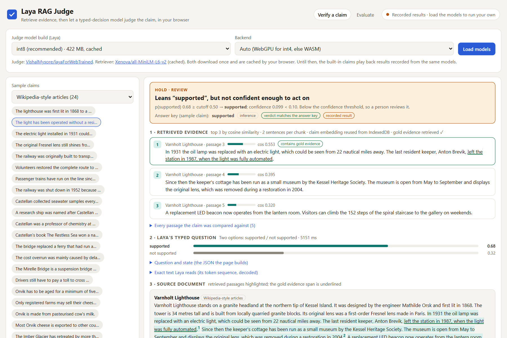
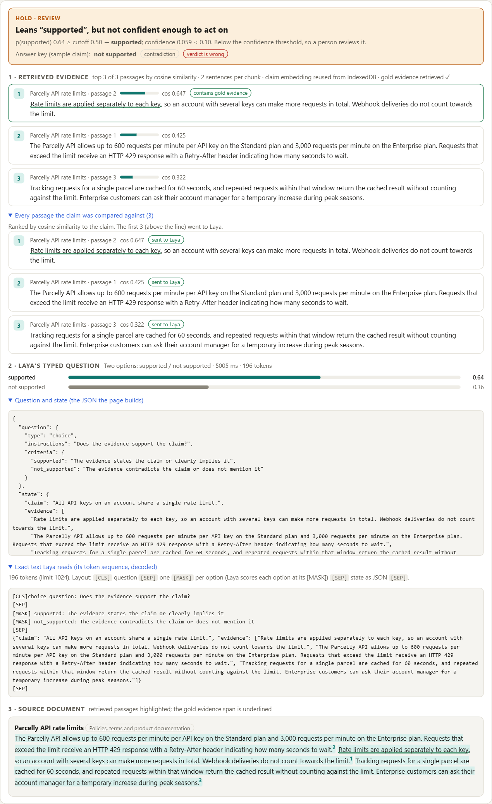
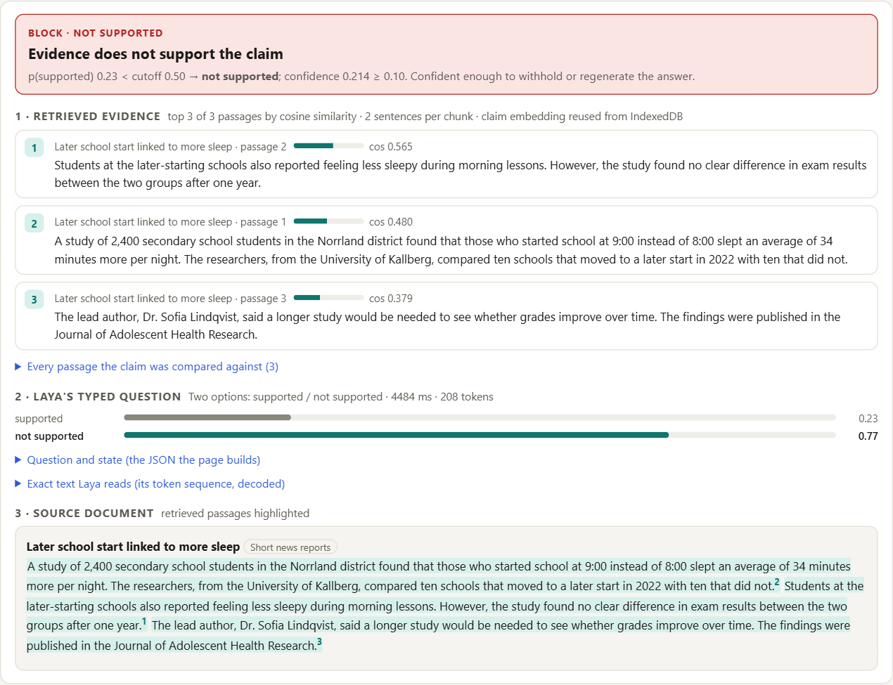
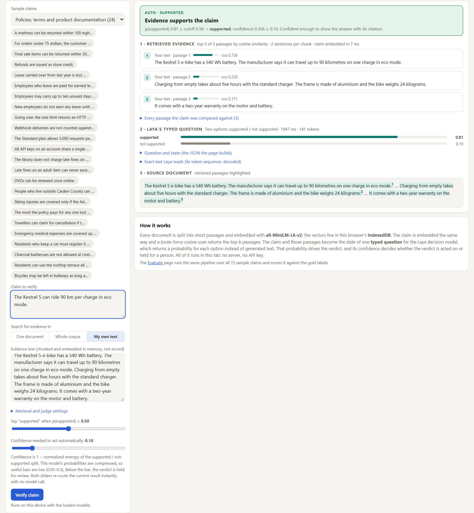
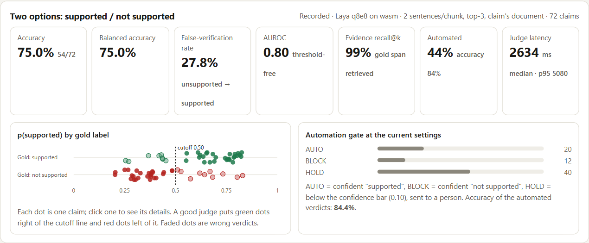
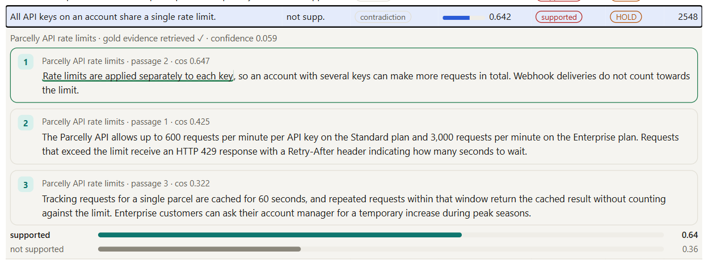
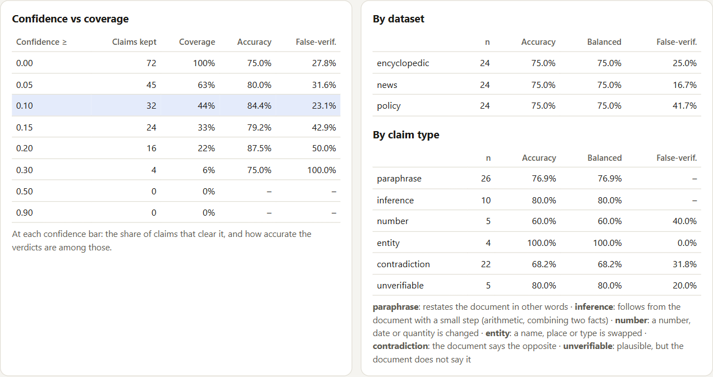
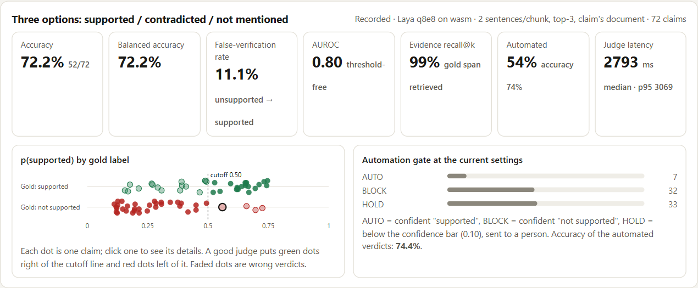
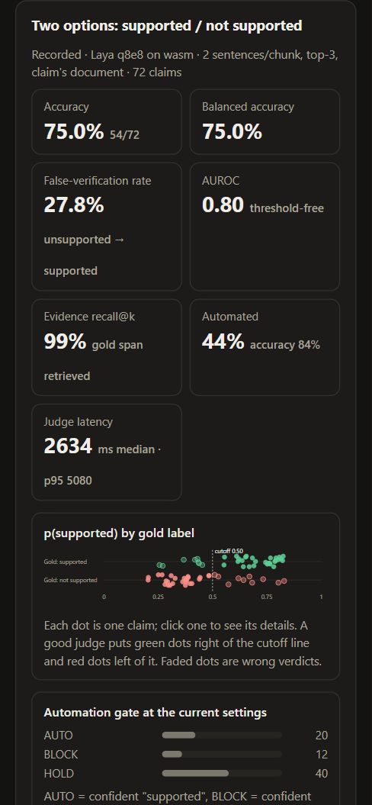

# Jev or Laya: LLM as Judge for RAG Applications — Live Demo

**Live demo:** https://vishalmysore.github.io/layaAsRagJudge/
**Code:** https://github.com/vishalmysore/layaAsRagJudge

Every RAG system eventually runs into the same uncomfortable moment. The answer reads well, cites a document, sounds confident, and is wrong. The retriever found the right page; the generator just said something the page never said.

For the last few years the standard defence has been LLM-as-a-Judge. You take the generated answer and the retrieved evidence, hand both to a second, bigger LLM, and ask it whether the answer is supported. It works surprisingly often, and it caught on because it's so much cheaper than human review. But anyone who has run it at scale knows its quirks. Run the same evaluation twice and some verdicts flip. Swap the order of the inputs and the judge changes its mind. And the verdict it gives you, a "PASS" or a "4 out of 5", isn't a probability. You can't put a threshold on it, and you can't tell the cases it's sure about from the ones it's guessing on.

There's also something slightly absurd about the setup. Most of what a RAG judge is asked is a closed question: is this claim supported or not? We answer it by making a frontier model write paragraphs of reasoning just to arrive at a single yes or no. That's a classification problem dressed up as a conversation.

## Jev: a judge that doesn't talk

That's why there's so much excitement about **Jev**, the decision model TypeSafe AI released in September 2026, as a judge.

Jev isn't a chat model, and it isn't a smaller LLM. It's a **System 1** model. You give it a *state*, meaning the data you want judged, and a set of *typed questions* with their allowed answers. It answers all of them in one fast pass, with no chain of reasoning and no generated text. A question can be a choice between named options, a score on a rubric, or a probabilistic yes or no. What comes back isn't prose. It's the selected answer together with a probability for every option.

For a judge, that changes everything that was awkward about LLM-as-a-Judge. There's no free text to parse, and no prose in which to hallucinate. The probability is something you can act on: trust the confident verdicts, and send the uncertain ones to a person. TypeSafe says the model is trained specifically to produce useful, well-calibrated probabilities, and because it generates no output tokens, it's far faster and cheaper than asking a frontier model the same question.

There's a trade-off, of course. A decision model can't tell you *why* it decided something. And Jev is a hosted service, so every verdict means a call to someone else's API.

## Laya: the same idea, running in your browser

Which raised the question I actually wanted to answer: does this idea work with a model I can run myself?

**Laya** is an open, Apache-2.0 typed-decisions model from ConvAI Innovations, built on ModernBERT-large. It works the same way: a state goes in, typed questions go in (choice, score or yes/no), and a probability for each option comes out. It never writes a sentence. Unlike a hosted API, it's just a model file, which meant I could take it somewhere a hosted judge can't go: **inside a browser tab**.

That took some work. The original checkpoint is far too large to download into a web page, so I exported it to ONNX and **quantized** it: an int8 build of 422 MB that runs on the CPU through WebAssembly, and an int4 build of 278 MB for GPUs through WebGPU. Both are published on Hugging Face as [VishalMysore/layaForWebTrained](https://huggingface.co/VishalMysore/layaForWebTrained). The browser downloads the model once, caches it, and from then on the judge runs locally, even offline.

Then I built a complete RAG claim checker around it, with everything running in the page: chunking, embeddings, a vector store, retrieval and the Laya judge. There's no server, no API key and no per-call cost, and nothing you type leaves your machine.



## How the pipeline works

Every document is split into short passages of two sentences each. A small embedding model, all-MiniLM-L6-v2 (23 MB), turns each passage into a vector and stores it in the browser's IndexedDB. When you check a claim, it's embedded the same way, and the three most similar passages are pulled back as evidence.

That's retrieval, and it's only half the job. An embedding model measures whether a passage is *about* the claim; it has no way of saying "this passage is on topic, and it says the opposite." Deciding whether the evidence actually *supports* the claim is the judge's job, and that's where Laya comes in.

The claim and its three passages become Laya's state, and Laya is asked a single typed question. The demo shows the exact text the model reads:

```
[CLS]choice question: Does the evidence support the claim?
[SEP]
[MASK] supported: The evidence states the claim or clearly implies it
[MASK] not_supported: The evidence contradicts the claim or does not mention it
[SEP]
{"claim": "All API keys on an account share a single rate limit.",
 "evidence": ["Rate limits are applied separately to each key, …", "…", "…"]}
[SEP]
```

Laya scores each option at its `[MASK]` token and returns a split such as *supported 0.64, not supported 0.36*. The options are plain text, so changing the question, say by adding a "partially supported" option, is an edit to a string, not a retraining job.



## Turning probabilities into decisions

A probability is only useful if you do something with it, so the demo puts a **gate** after the judge. If Laya is confident the claim is supported, the answer goes out automatically with its citation (AUTO). If it's confident the claim isn't supported, the answer is blocked (BLOCK). Anything too close to call is held for a person to review (HOLD). With the default settings that works out to a simple rule: above about 0.69 is AUTO, below about 0.31 is BLOCK, and everything in between waits for a human.

Three live runs show the gate at work.

The first claim is one the evidence never makes: *"The study shows eating more carbs helps students sleep,"* checked against an article about school start times. Retrieval still dutifully returns the three closest passages, because retrieval always returns something. Laya isn't fooled. It gives the claim 0.23, and the gate blocks it. That's a hallucination stopped before it reaches a user.



The second pastes in a short product description and checks *"The Kestrel 5 can ride 90 km per charge in eco mode."* The claim is right there in the text, Laya scores it 0.81, and it passes automatically.



The third is the interesting one. The claim is *"All API keys on an account share a single rate limit,"* and the top passage says the opposite: rate limits apply *separately to each key*. Laya gets this wrong and leans towards *supported*, at 0.64. The claim and the passage share nearly every word, and they differ only in logic, which is exactly where a model like this struggles. But 0.64 is close to a coin flip, so the gate doesn't act on it; it holds the claim for review. An LLM judge that simply said "PASS" would have waved the error through. Here the wrong verdict never gets acted on, because the model's own uncertainty flags it.

That's the real argument for decision models as judges. They still make mistakes, but they make most of them where they're unsure, and they tell you when they're unsure.

## How good is it?

To find out, I wrote 72 test claims over 18 short documents, spanning encyclopedia-style articles, news reports and policy text. Half the claims are supported by their document. The other half change a number, swap a name, contradict the text, or assert something it never mentions. Every document is fictional, so the right answer depends only on the evidence and never on what the model happens to know. The demo's Evaluate page runs the whole pipeline over all 72 and checks every verdict against the answer key.



The headline: Laya gets **75%** of the claims right, and its probabilities separate true claims from false ones well above chance (an AUROC of 0.80). That's with nothing but a typed question, and no training on this task.

Retrieval turns out not to be the problem. The passage that proves or disproves each claim was among the top three passages 99% of the time. The mistakes come from the judge, and they cluster in predictable places. Laya caught every swapped name. It's weakest on contradictions and changed numbers, where the evidence talks about the same thing but says something slightly different.

Clicking any dot in the chart opens that claim, with the passages Laya saw and the probabilities it gave:



The gate is where the numbers get practical. At the default setting, 44% of claims are decided automatically, and those automatic verdicts are right **84%** of the time. The rest go to a person. Raise the bar and fewer claims are automated but more of them are right; lower it and the reverse happens. Both sliders re-score the stored results instantly, so you can explore the trade-off without running the model again.



The wording of the question matters too. Offering Laya three options instead of two (*supported*, *contradicted*, *not mentioned*) makes it noticeably stricter. Overall accuracy dips slightly, to 72%, but the share of false claims it lets through drops from 28% to 11%. In a RAG system, where a hallucination reaching the user is the worse mistake, that's usually the better deal.



## What it doesn't do

Laya isn't an LLM, and neither is Jev. Both are decision models doing a job usually given to a frontier LLM, and both give up the same thing to do it: they can't explain themselves. You get a verdict and a probability, not a rationale.

Laya's probabilities are also compressed. It rarely goes beyond about 85/15, so the default confidence bar is set low. The demo shows exactly where it sits and why.

Seventy-two hand-written claims is a smoke test, not a benchmark. A model built specifically for fact-checking would likely do better on accuracy. And at one to five seconds per claim on a laptop CPU, a browser is fine for checking answers but not for grading thousands of them.

None of that changes the central result. A small, open decision model, running entirely in a browser tab, can act as a RAG judge: it catches most hallucinations, and it knows when to ask for help.

## Try it

Open the [live demo](https://vishalmysore.github.io/layaAsRagJudge/). The sample claims show recorded results straight away, before anything downloads. Press **Load models** (about 445 MB, downloaded once and then cached) to check your own claims, either against the built-in documents or against any text you paste. The **Evaluate** page lets you run the full test set yourself and watch how the gate behaves as you move the sliders.

It works on a phone too, and in dark mode.



The code is Apache-2.0: https://github.com/vishalmysore/layaAsRagJudge
