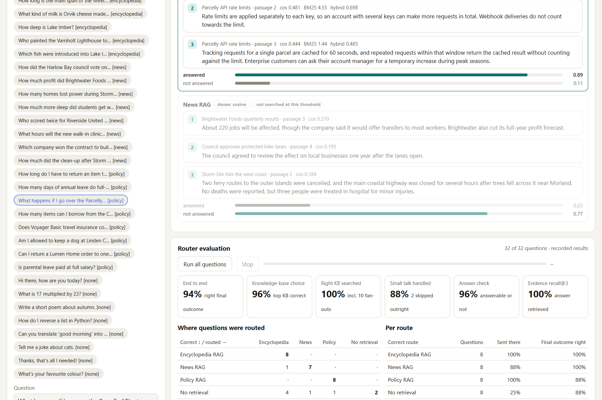
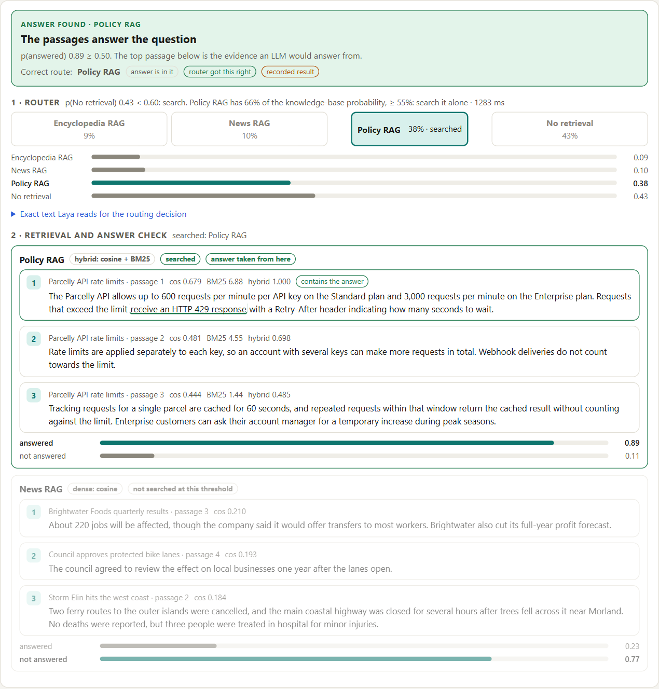
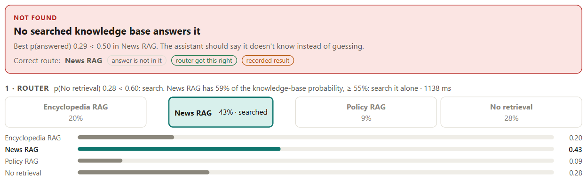
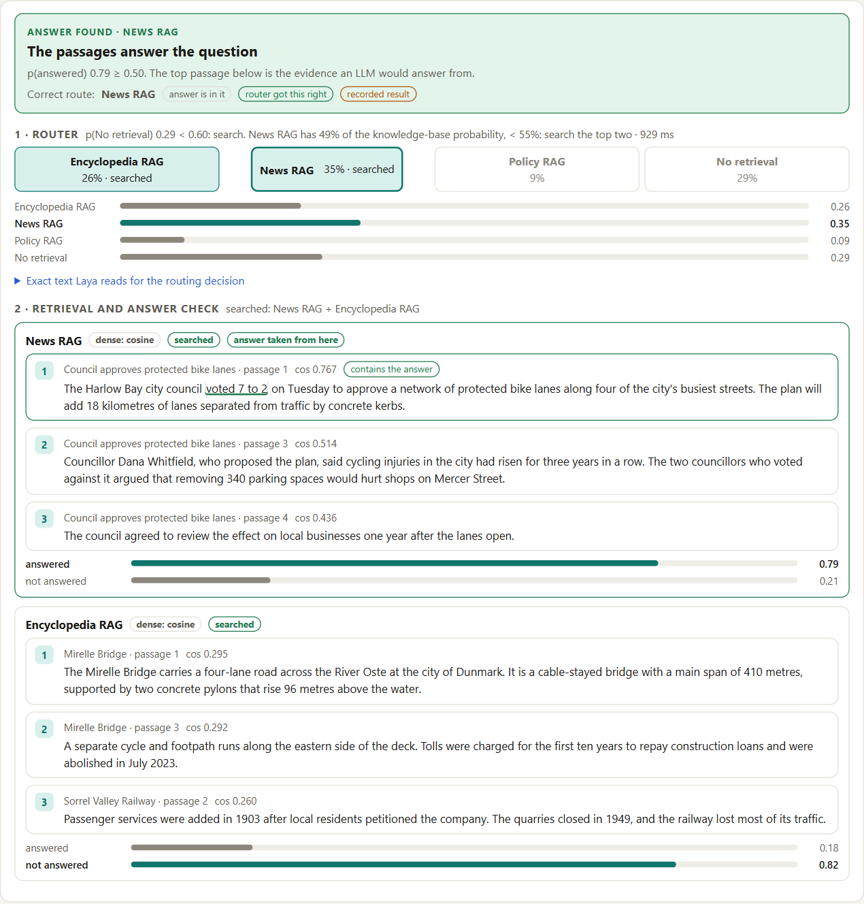
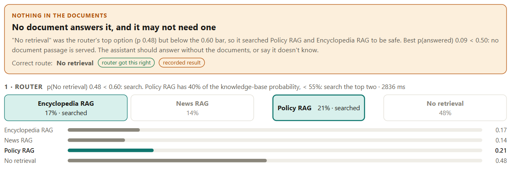
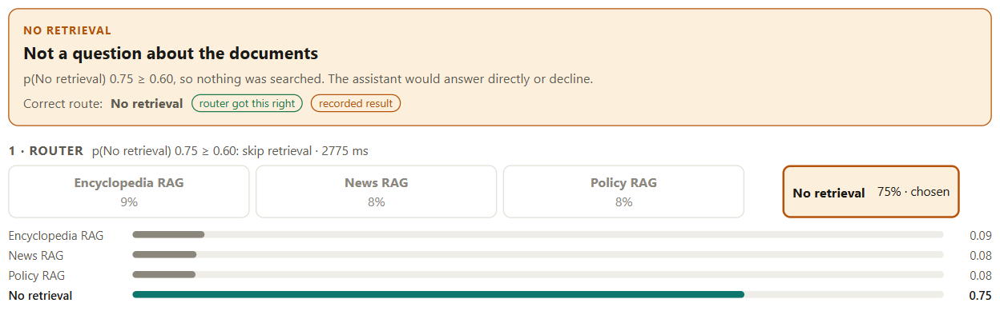
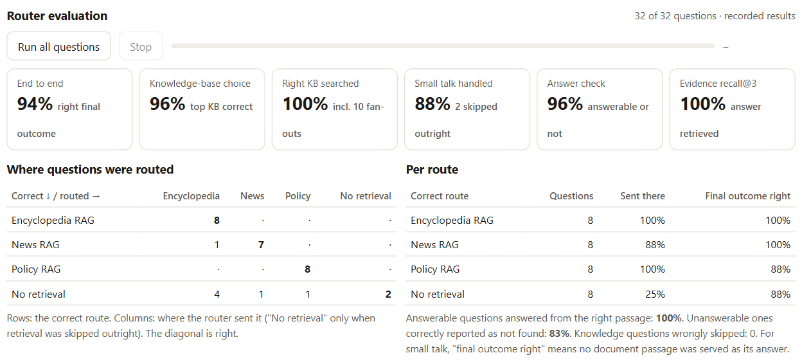
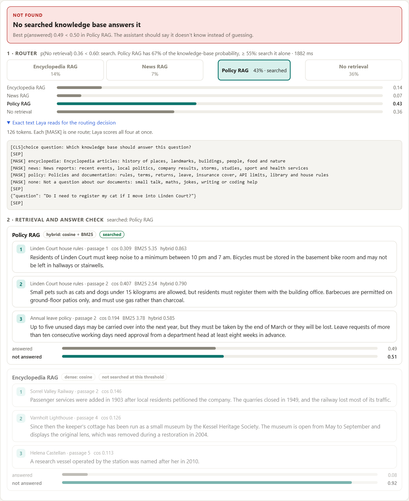
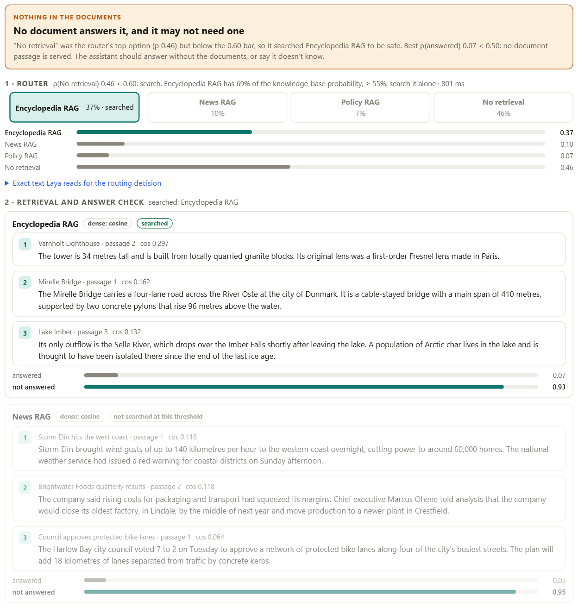
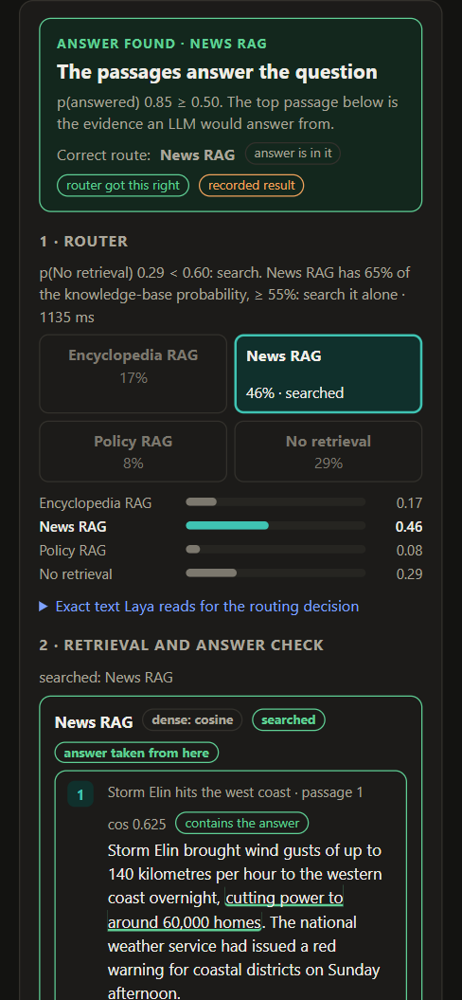

# One Question, Four Destinations: A RAG Router Built on Laya, Running 100% in Your Browser

**Live demo:** https://vishalmysore.github.io/layaAsRagJudge/router.html
**Code:** https://github.com/vishalmysore/layaAsRagJudge

In the [previous article](article.md) I used Laya, an open typed-decisions model, as the *judge* at the end of a RAG pipeline: after retrieval, it decides whether the evidence actually supports a claim. That's one decision. But a real RAG system makes several decisions before it ever gets to judging, and the first one is easy to overlook: **where should this question go at all?**

Most production assistants don't sit on one neat pile of documents. There's a product knowledge base, a policy manual, a stream of news or tickets. And a good share of what users type isn't a lookup at all: "thanks!", "what's 17 times 23?", "write me a poem". Send everything to one giant index and you get noisy retrieval. Send small talk to any index and the model will happily "ground" a joke in a refund policy.

That makes routing a decision problem, the kind a typed-decision model is built for. So I built a router around Laya, and like everything else in this project, it runs entirely in a browser tab.

## Four destinations

The demo has three knowledge bases and one way out:

- **Encyclopedia RAG:** articles about places, landmarks, people, food and nature
- **News RAG:** reports about recent events, votes, company results, storms, studies and sport
- **Policy RAG:** rules and documentation, like returns, leave, insurance cover, API limits and house rules
- **No retrieval:** small talk, maths, jokes, writing or coding help, where looking anything up is the wrong move

They aren't just labels on one index. Each knowledge base is its own RAG with its own retriever. Encyclopedia and News use dense retrieval: the question and every passage are embedded with MiniLM, and the closest passages win. Policy RAG uses **hybrid** retrieval, mixing the same cosine similarity with BM25 keyword scoring. Policy text is full of exact terms and numbers ("HTTP 429", "15 items", "30 days") that a keyword match catches and an embedding can blur.

## Two questions to Laya

The router asks Laya two typed questions.

The first is the **routing question**. The user's question becomes the state, and the four destinations become the options, each described in a plain sentence. Laya scores all four at once and returns a probability for each. There's no prompt engineering beyond those four descriptions, and no generated text to parse.

The second comes after retrieval: the **answer check**. Given the question and the passages that came back, do the passages actually contain the answer? This is the part people tend to skip, and it's what lets the assistant say "I couldn't find that" instead of confidently summarizing whatever happened to be retrieved.

## The first version didn't work

My first router did the obvious thing: send the question to whichever destination Laya rated highest. On 32 labeled test questions it got the final outcome right only **78%** of the time. Every mistake was the same: a perfectly ordinary knowledge question, like "How deep is Lake Imber?", sent to *No retrieval*, so nothing was ever searched.

The interesting part came from looking at the probabilities instead of the verdicts. Two things stood out.

First, **Laya was very good at choosing between the knowledge bases.** Setting "No retrieval" aside and looking only at the three knowledge bases, it picked the right one for 23 of 24 questions. Its single slip sent an unanswerable news question to the encyclopedia.

Second, the "look it up or not" decision was genuinely fuzzy. Knowledge questions got a *No retrieval* probability anywhere from 0.28 to 0.54. Real small talk got 0.48 to 0.75. The two ranges overlap, so no single argmax could separate them.

The fix was to stop treating routing as one decision, because it's really two:

1. **Skip retrieval only when the model is clearly sure.** If *No retrieval* reaches 0.60, skip; anything less gets searched. A wasted search is cheap. A skipped search on a real question means a wrong answer.
2. **Choose the knowledge base among the knowledge bases alone.** If the leader holds at least 55% of the knowledge-base probability, search it alone. Otherwise search the top two and let the answer check decide which one actually answered.

That second step, fanning out when unsure, turned out to matter a lot:

And the first step works because the answer check is so reliable at rejecting small talk. When "How do I reverse a list in Python?" gets searched, the check simply finds nothing, and no document passage is ever served as an answer:

When the model *is* sure, it skips retrieval entirely:

## How well it works now

With the two-step decision, on the same model outputs and without a single extra model call, the router gets the final outcome right for **30 of 32 questions (94%)**:

- The right knowledge base was searched for **every** knowledge question, ten of them through fan-out.
- **No** knowledge question was wrongly skipped.
- The answer check was right 96% of the time, and the passage with the answer was in the top three for every answerable question.

Both remaining errors are answer-check mistakes, not routing mistakes. A passage about *online* returns was accepted as answering a question about returning to a *physical* store, and "What is 17 × 23?" scraped past the cutoff at 0.52 against an unrelated encyclopedia passage.

One honest caveat: I chose the 0.60 and 0.55 thresholds after seeing these same 32 questions, so 94% is an optimistic number. The untuned first design scored 78%. The real result is the *pattern*: split the decision, fan out when unsure, and let a verification step clean up.

## Two live questions

Recorded results are one thing; here are two questions that aren't in the test set, run live in the browser.

*"Do I need to register my cat if I move into Linden Court?"* The router sends it straight to Policy RAG, and hybrid retrieval brings back the right house-rules passage: small pets are allowed, but residents must register them with the building office. Then the answer check hesitates, at 0.49, a hair under the 0.50 cutoff, and the page reports *not found*.

That's a miss, and I left it in on purpose, because it shows where the weak link is. Routing and retrieval both did their jobs. The answer check struggles when the question is phrased differently from the passage ("do I need to register" versus "residents must register them"), the same weakness with paraphrase that showed up when Laya was the claim judge. Moving the cutoff slider to 0.45 turns it into a found answer, but that also lets more false positives through. That trade-off is exactly what the sliders are there to explore.

*"What is the capital of France?"* is a real factual question that none of the documents cover. The router leans towards No retrieval but not strongly enough to skip, so it searches the Encyclopedia RAG. The answer check gives the best passage 0.07, and nothing is served.

That's the behaviour you want. The documents don't know, so the assistant shouldn't pretend they do.

## Why a decision model fits this job

Routing is a textbook case for a typed-decision model. The answer space is closed, there are exactly four destinations, and what you need back isn't an explanation but a probability you can put thresholds on. An LLM router would work too, but it would spend generated tokens to produce a label, and it would hand back that label with no reliable sense of how sure it was. Here the probabilities are what made the design possible. Without them I couldn't have seen that "which knowledge base" was easy and "whether to look up" was hard, and I couldn't have built a router that searches more when it's unsure.

It also all runs where the documents are. The quantized Laya model, the MiniLM retriever, the passage index in IndexedDB and all three RAGs live in one browser tab. Routing, retrieval and the answer checks together take a few seconds per question on a laptop CPU, and nothing leaves the machine.

## Try it

Open the [router demo](https://vishalmysore.github.io/layaAsRagJudge/router.html). All 32 sample questions play back recorded results before anything is downloaded. Click any of them to see the routing probabilities, which knowledge bases were searched, the retrieved passages and the answer check. Press **Load models** to ask your own questions. Drag the three sliders to see how the skip threshold, the fan-out threshold and the answer cutoff trade coverage against mistakes, with no model calls needed.

It works on a phone too.

The code is Apache-2.0: https://github.com/vishalmysore/layaAsRagJudge

## Disclaimer

Built on Laya by ConvAI Innovations (Apache-2.0), itself built on ModernBERT-large. This is an unofficial project and is not affiliated with ConvAI Innovations. All example questions and documents are synthetic.

Personal views only. I am not affiliated with ConvAI Innovations. Laya is new, so details may change. The router's thresholds were tuned on the same 32 questions they are evaluated on, so the headline accuracy is optimistic. The browser demo is an unofficial port of Laya (Apache 2.0).
